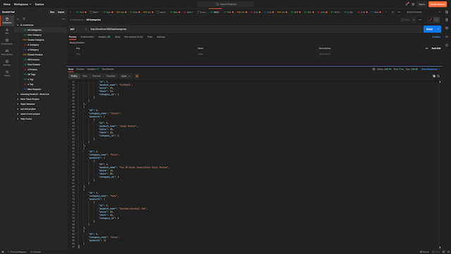
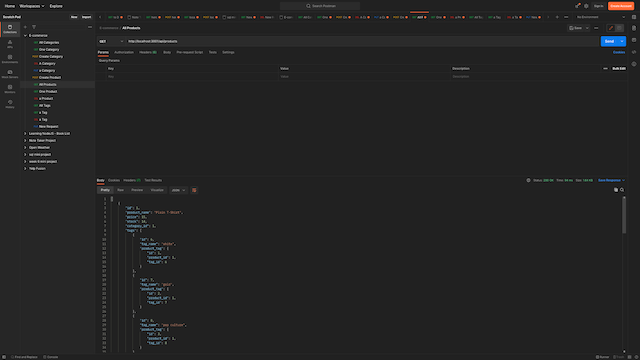
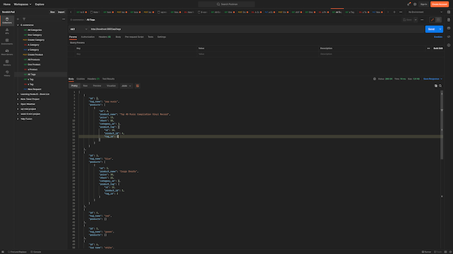
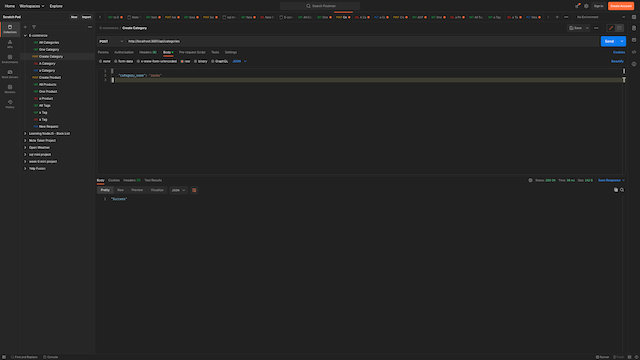

# E-Commerce-Back_end

  

  ## Description:
        
  An Express.js API using Sequelize to interact with a MySQL database that contains simulated data for an E-commerce platform.
    
  ---

  ## Demo of Project:
  - [Demo](https://watch.screencastify.com/v/ybh76KFJyU4ev0CfTr0Z)
  
  ## Table of Contents:
    
  - [Instillation](#instillation)
  - [Usage](#usage)
  - [Credits](#credits)
  - [License](#license)
  - [Questions](#questions)
  
  ## Instillation:
  
  To install this project, Please clone down the code from the github repo to your local machine. Open the app.js file in a terminal and run the following commands: 
  1. npm i
  2. node seeds
  3. node app.js
  
  This will allow you to seed a database which you can either make yourself or copy the mysql scripts from the schema file to create a new database.
  
  ## Usage:
  
  Practice with and view what the backend of an ecommerce application may require.
  
  ## ScreenShots:
  

  ---

  

  ---

  
  
  ---

  

  ---

  

  ## Credits:
  
  Third-party Assets:
  - Node.js
  - Express.js
  - DBeaver
  - Sequelize

  Assistance:

  Assistance provided by:
  - github [@egarrisxn](https://github.com/EGARRISXN)

  ## License:
  
  This project uses the [MIT](https://opensource.org/licenses/MIT) license.

  ---
  
  ## Questions:

  Please feel free to get in contact if you have any questions about this project.

  - Github: [jamesgit22](https://github.com/jamesgit22)
  - Email: jamesschroedermail97@gmail.com